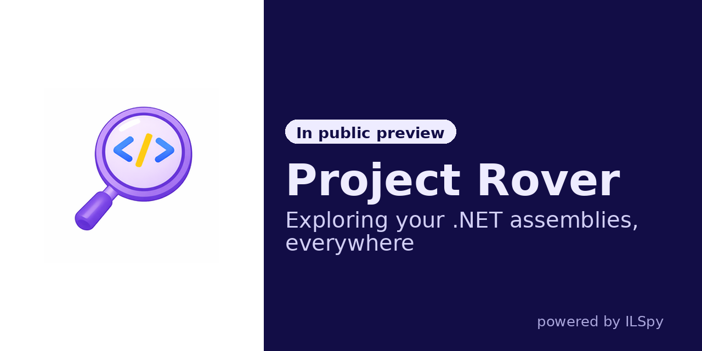
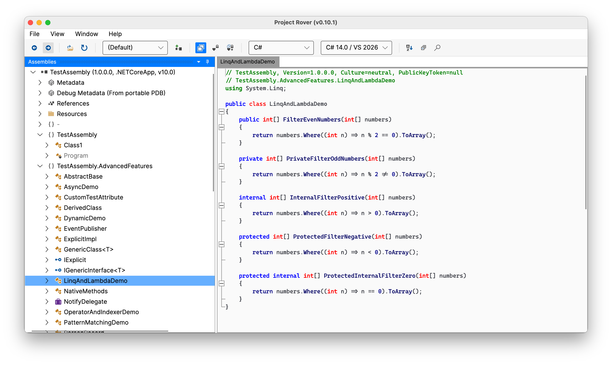
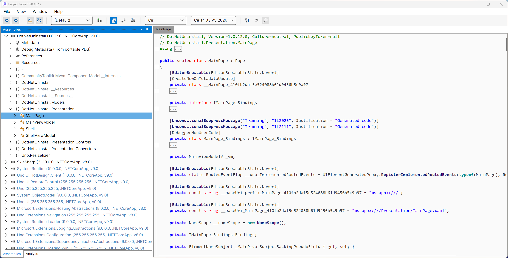
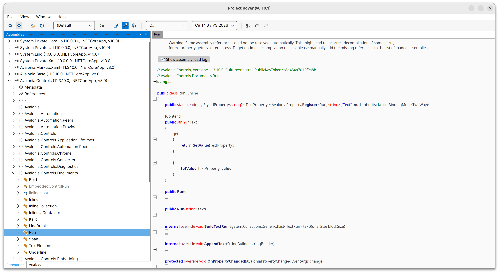

# Project Rover

A small, cross-platform UI for exploring .NET assemblies.

- **Stable Releases:** [Downloads](https://github.com/lextudio/ProjectRover/releases)
- **Unstable Builds:** [CI artifacts](https://github.com/lextudio/ProjectRover/actions/workflows/package.yml)

## Table of Contents

- [Quick Start](#quick-start)
- [Screenshots](#screenshots)
- [Build from source](#build-from-source)
- [Before reporting any issues](#before-reporting-any-issues)
- [Layout](#layout)
- [Status](#status)
- [License](#license)

## Quick Start

Downloads are on the [Releases page](https://github.com/lextudio/ProjectRover/releases).

Download the latest release archive for your platform from the Releases page, extract it, and run the app.

### **macOS**

- Extract the universal `.tar.gz` and open `ProjectRover-macos-universal.dmg`.
- Drag the Project Rover icon to the Applications folder.
- Run `ProjectRover.app` from the Applications folder. You may need to bypass Gatekeeper on first launch:

  ```bash
  xattr -d com.apple.quarantine /Applications/ProjectRover.app
  open /Applications/ProjectRover.app
  ```

<p align="center">
  
</p>
*macOS: main window and code view.*

### **Windows**

- Extract and run `ProjectRover.exe`.

<p align="center">
  
</p>
*Windows: assembly tree and context menus.*

### **Linux**

- Extract and run the `ProjectRover` binary. Example:

  ```bash
  mkdir ProjectRover && tar -xzpf ProjectRover-linux-x64.tar.gz -C ProjectRover
  chmod +x ProjectRover/ProjectRover
  ./ProjectRover/ProjectRover
  ```

<p align="center">
  
</p>
*Linux: decompiled code.*

## Build from source

.NET 10 SDK is required. Then run:

```bash
git clone https://github.com/LeXtudio/ProjectRover.git
cd ProjectRover
git submodule update --init --recursive
cd src/ProjectRover
dotnet run
```

## Before reporting any issues

Please read [TROUBLESHOOTING.md](TROUBLESHOOTING.md) for step-by-step instructions for shipped users and other debugging tips.

## Layout

- `src/ProjectRover` – Avalonia application, shims for view models and other supporting files.
- `thirdparty/AvaloniaEdit` – bundled text editor control.
- `src/ILSpy` - Original ILSpy source code, mostly unmodified.

## Status

- Active development, not production ready. Expect bugs and missing features.
- Current focus is on code reuse and keeping up with ILSpy.

## License

This project is [AGPL](COPYING) licensed. It depends on ILSpy (MIT); see [THIRD-PARTY-NOTICES](THIRD-PARTY-NOTICES.md).
